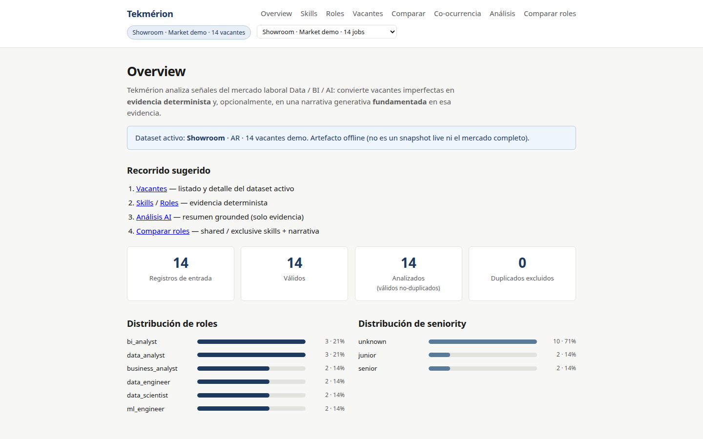
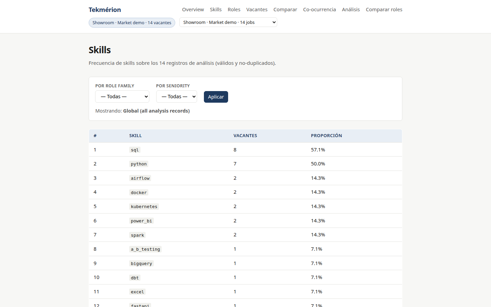
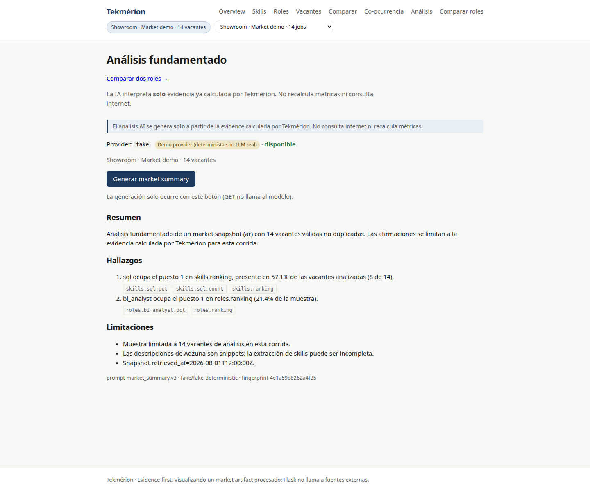
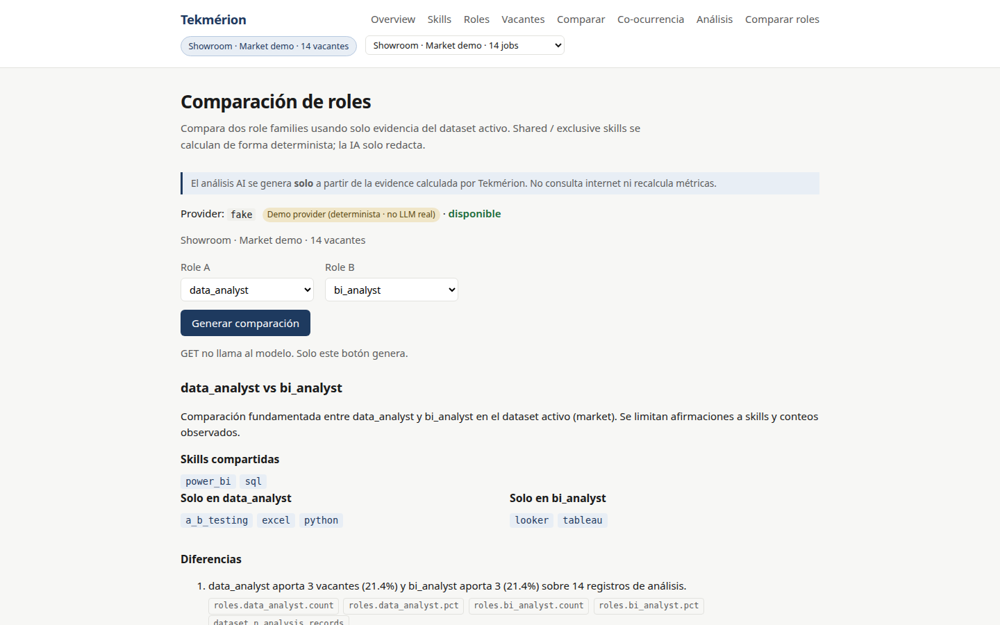
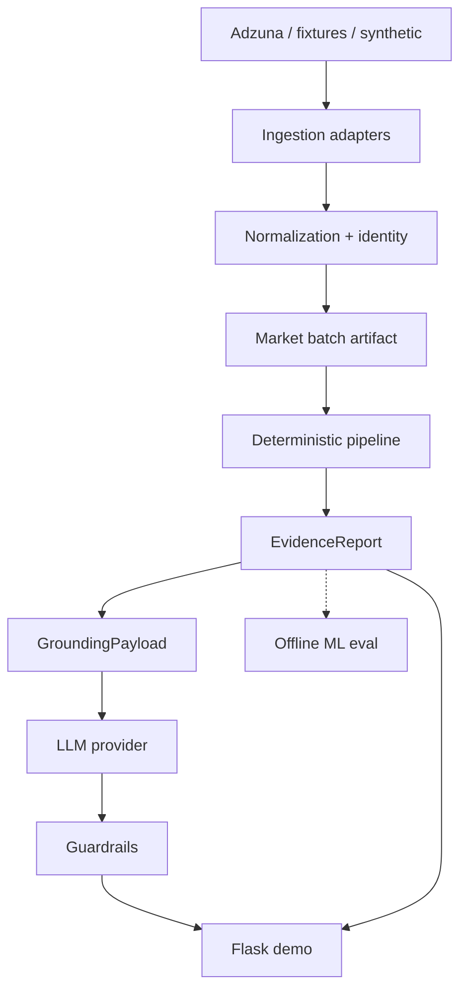
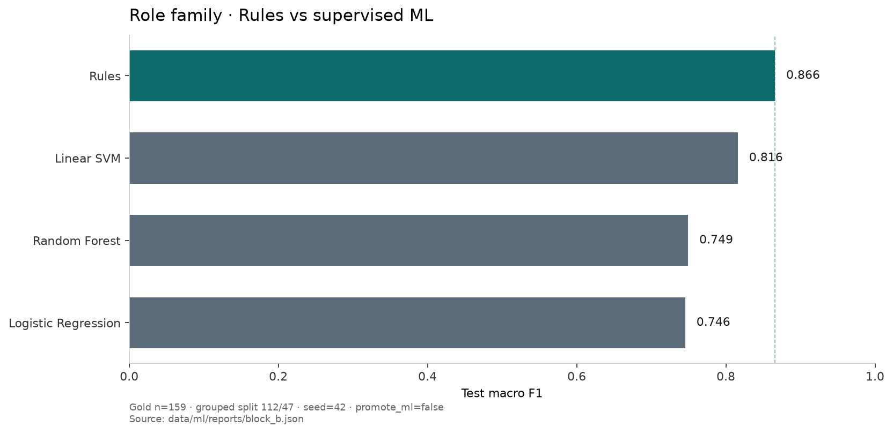

# Tekmérion

**Evidence-first analysis of Data, BI and AI job-market signals.**

Tekmérion turns messy job postings into **structured evidence**, then optionally into a **grounded** narrative. Counts, skills and rankings come from deterministic code — not from a model inventing the market.

> Data → deterministic pipeline → Evidence → Grounding → Guardrails → Flask demo

[](https://www.python.org/)
[](LICENSE)
[](#tests)

---

## Problem

Data, BI and AI roles are published with inconsistent titles and incomplete descriptions. Comparing “what the market asks for” is hard if a generative model is allowed to **calculate** the market.

Tekmérion separates:

| Layer | Who decides |
|------|----------------|
| Counts, skills, rankings | Deterministic `EvidenceReport` |
| Narrative | LLM only on a `GroundingPayload` |
| Validation | Local numeric, ranking and scope guardrails |
| Role-family ML | Offline evaluation vs rules — **not** wired to Evidence |

---

## Demo (offline)

No Adzuna key, no LLM key, no database, no network:

```powershell
.\scripts\run_demo.ps1
# → http://127.0.0.1:5000
```

Walkthrough: **Showroom → Jobs → Evidence → AI Analysis → Role Comparison**



<p align="center"><sub>Showroom dataset · 14 demo jobs (not a live snapshot)</sub></p>

| Evidence | Grounded AI (demo provider) | Role comparison |
|:---:|:---:|:---:|
|  |  |  |

<p align="center"><sub>The <strong>Demo provider (deterministic · not a real LLM)</strong> badge appears when <code>TEKMERION_LLM_PROVIDER=fake</code>.</sub></p>

Flask **never** calls Adzuna. The UI only loads local datasets (synthetic / showroom / processed market).

---

## Architecture



---

## Applied Machine Learning (V0.8)

Human **Gold Dataset** (`gold_role_family`, never copied from regex). Grouped train/test split by title+description fingerprint (anti-leakage). TF-IDF + skills **fit on train only**. Logistic Regression, Linear SVM and Random Forest vs `classify_role_family` on the **same** held-out test set. Primary metric: **macro F1** (class imbalance).

Gold: **159** labeled examples, **≥10 per class**, train/test **112 / 47** (seed 42). The labeled vacancy corpus is **not redistributed**. Public artifacts are the schema, synthetic fixtures, class counts, dataset hash, sanitized manifests/reports, and the chart below.

Vacancy data used in the ML evaluation was sourced from [The Adzuna API](https://developer.adzuna.com/).



| Predictor | Accuracy | Macro F1 |
| ------------------- | -------: | --------: |
| Rules | 0.872 | **0.866** |
| Linear SVM | 0.872 | 0.816 |
| Random Forest | 0.830 | 0.749 |
| Logistic Regression | 0.830 | 0.746 |

**`promote_ml=false`.** sklearn was trained and scored; it did **not** beat the deterministic baseline on test macro F1. Accuracy ties Linear SVM with rules and is not the promotion criterion.

That is an **evidence-based decision**, not a failed experiment: the evaluation contract worked, and the production path stays with audited rules until a model wins on the metric that matters.

---

## Quick Start

```powershell
git clone https://github.com/AgusDelgado98/Tekmerion
cd Tekmerion
python -m venv .venv
.\.venv\Scripts\Activate.ps1
pip install -e ".[dev]"
pytest -q
.\scripts\run_demo.ps1
```

`pip install -e ".[dev]"` includes pytest and scikit-learn (needed for V0.8 training/comparison). Flask-only: `pip install -e .`. ML extra without pytest: `pip install -e ".[ml]"`.

Linux / macOS:

```bash
python -m venv .venv && source .venv/bin/activate
pip install -e ".[dev]"
pytest -q
./scripts/run_demo.sh
```

Optional live CLI (not used by the demo):

```powershell
$env:ADZUNA_APP_ID="..."
$env:ADZUNA_API_KEY="..."
python scripts/fetch_market.py --country ar --limit-per-query 5 --save-market
```

---

## Tests

```powershell
pytest -q
```

Offline tests (pipeline, ingestion, Flask, guardrails, ML eval). No network, no Adzuna key, no local Gold Dataset.

Published metrics live in `data/ml/gold/evaluation_card.json` and `data/ml/reports/block_b.json`. Retraining on the original 159 examples is a **local** step (gitignored gold), not Quick Start.

---

## Limitations

- The full real vacancy corpus used for ML evaluation is not in this repository (code, methodology, fixtures and evaluation artifacts are).
- Evaluation used Adzuna **search snippets** (typically ≤500 characters), not full job descriptions. Raw live snapshots stay local (gitignored).
- Showroom and samples are not the full job market.
- API snippets can omit skills that exist in the full posting.
- Guardrails do not verify all qualitative prose.
- No auth, scheduler, or production deploy.

---

## Documentation

| Doc | For |
|-----|-----|
| [Case study](docs/case-study.md) | Hiring managers |
| [Architecture](docs/architecture.md) | Component boundaries |
| [Methodology](docs/methodology.md) | Technical detail |
| [Learning path](docs/learning-path.md) | How V0.8 applies ML concepts |
| [Portfolio story](docs/portfolio-story.md) | Short narrative |
| [ADR index](docs/adr/README.md) | Decisions |
| [Assets](docs/assets/README.md) | Screenshots |

---

## License

MIT — [LICENSE](LICENSE)

## Status

**V0.8.0 — Applied ML** — Gold gate met; Rules vs sklearn compared; `promote_ml=false`. Evidence and the production pipeline do not load ML models.
