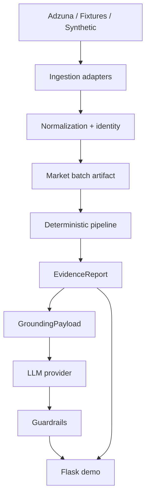

# Tekmérion

**Evidence-first analysis of the Data, BI & AI job market.**

Tekmérion convierte vacantes imperfectas en **evidencia estructurada** y, opcionalmente,
en una narrativa generativa **fundamentada** en esa evidencia — no en conocimiento inventado del modelo.

> Datos → pipeline determinista → Evidence → Grounding → Guardrails → Demo

---

## Demo

Arranque offline (sin Adzuna ni API key de LLM):

```powershell
$env:TEKMERION_DATA_MODE="showroom"
$env:TEKMERION_LLM_PROVIDER="fake"   # DEMO determinista — no es un LLM real
python -m app
```

O: `.\scripts\run_demo.ps1`

Recorrido: **Showroom → Vacantes → Evidence → AI Analysis → Role Comparison**


<p align="center"><sub>Dataset Showroom offline · 14 vacantes demo (no es un snapshot live)</sub></p>

### Evidence · AI · Role comparison

| Evidence | Grounded AI (demo provider) | Role comparison |
|:---:|:---:|:---:|
|  |  |  |

<p align="center"><sub>El badge <strong>Demo provider (determinista · no LLM real)</strong> aparece cuando <code>TEKMERION_LLM_PROVIDER=fake</code>.</sub></p>

---

## Why it is different

| Capa | Quién decide |
|------|----------------|
| Conteos, skills, rankings | Código determinista (`EvidenceReport`) |
| Narrativa | LLM solo sobre `GroundingPayload` |
| Validación | Guardrails locales (números, rankings, scope) |

El modelo **no** calcula el mercado. Si inventa un %, ranking o skill fuera de scope, Tekmérion rechaza la respuesta.

---

## Architecture



Flask **nunca** llama a Adzuna. La UI solo carga datasets locales (synthetic / showroom / market snapshot).

---

## Technical highlights

- Python 3.10+ · Flask · pipelines deterministas
- Ingestión Adzuna (API oficial) + fixtures offline
- Identity namespaced · market batch · artifacts auditables
- Grounded generation (`market_summary`, `role_comparison`)
- Numeric & ranking claim guardrails
- DatasetRegistry + switch por sesión
- **253+** tests offline

---

## Quick Start (Windows PowerShell)

```powershell
git clone https://github.com/AgusDelgado98/Tekmerion
cd Tekmerion

python -m venv .venv
.\.venv\Scripts\Activate.ps1
pip install -e ".[dev]"

pytest -q

# Portfolio demo (showroom + fake AI)
.\scripts\run_demo.ps1
# → http://127.0.0.1:5000
```

### Linux / macOS

```bash
python -m venv .venv && source .venv/bin/activate
pip install -e ".[dev]"
pytest -q
./scripts/run_demo.sh
```

No requiere Adzuna key, LLM key, base de datos ni red para la demo showroom.

### Opcional — live

```powershell
# Adzuna CLI only
$env:ADZUNA_APP_ID="..."
$env:ADZUNA_API_KEY="..."
python scripts/fetch_market.py --country ar --limit-per-query 5 --save-market

# LLM live
$env:TEKMERION_LLM_PROVIDER="openai_compatible"
$env:TEKMERION_LLM_API_KEY="..."
```

---

## Datasets

| Dataset | Qué es | Secretos |
|---------|--------|----------|
| **Synthetic** | Muestra de desarrollo | No |
| **Showroom** | Demo market offline versionada | No |
| **Market snapshot** | Artifact local procesado | No en la web |

`TEKMERION_LLM_PROVIDER=fake` produce salida **determinista de demostración**. No es una llamada a un modelo real.

---

## Tests

```powershell
pytest -q
```

---

## Limitations

- Showroom y samples no representan el mercado completo
- Snippets de API pueden omitir skills reales
- Guardrails no verifican toda la prosa cualitativa
- Sin auth / deploy de producción

---

## Documentation

| Doc | Para qué |
|-----|----------|
| [Case study](docs/case-study.md) | Lectura para hiring managers |
| [Architecture](docs/architecture.md) | Fronteras de componentes |
| [Methodology](docs/methodology.md) | Detalle técnico |
| [Portfolio story](docs/portfolio-story.md) | Narrativa corta |
| [ADR index](docs/adr/README.md) | Decisiones |
| [Assets](docs/assets/README.md) | Screenshots |

---

## License

MIT — ver [LICENSE](LICENSE)

## Status

**V0.7.0 — Portfolio Packaging** (screenshots + showroom demo · portfolio-ready candidate, no 1.0)
